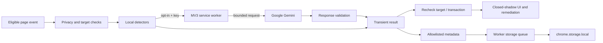

# Sentiency

<p align="center"></p>

Sentiency is an experimental Chrome Manifest V3 extension for detecting potential prompt injection in browser text and images. It combines local heuristics with optional Google Gemini classification, offers paste remediation, and shows a local activity log. It is a review aid, **not a guarantee that content or a conversation is safe**.

**Privacy defaults:** automatic engines start off, and remote analysis requires a separate opt-in. Saving an API key does not enable remote transmission. Credential fields and recognized authentication forms are excluded before capture. Content in ordinary fields can still contain secrets; Sentiency is not a general secret-redaction tool.

## Install and build

Requirements: Node.js **22.14 or newer**, npm, and a Chromium browser supporting Manifest V3 and the Chrome side panel API. The lockfile is committed; use `npm ci` for repeatable dependencies.

```sh
git clone https://github.com/desenyon/sentiency.git
cd sentiency
npm ci --no-audit
npm run build
```

1. Open `chrome://extensions` and enable Developer mode.
2. Choose **Load unpacked** and select the generated `dist/` directory.
3. Open Sentiency's extension options. Review the transmission disclosure before enabling **Allow remote analysis**.
4. If remote analysis is wanted, save a Google Gemini API key and enable the individual engines you want. Settings require **Save settings**. The **Test** button sends a fixed test prompt to Google when clicked, independently of the remote-analysis setting.
5. Reload existing web pages after installing or reloading the extension. Old content scripts can retain an invalid extension context until the page reloads.

`npm run dev` rebuilds in watch mode. Reload the unpacked extension and affected pages after changes. This repository does not publish or deploy the extension automatically.

The configured endpoint is `https://generativelanguage.googleapis.com/v1beta/models/gemini-3.1-flash-lite-preview:generateContent`, defined in [`src/shared/constants.js`](src/shared/constants.js). This is a configured preview-model identifier, not a claim of current model availability. Model access, quota, cost, and API compatibility depend on the user's Google project. Tests never contact the live model.

## Privacy and transmission

| Action | Content used | Remote behavior |
| --- | --- | --- |
| Paste engine | Plain text from a paste event in an eligible editable field; minimum 8 characters | Classifier requested for each intercepted paste, subject to remote opt-in and a key |
| Copy engine | Selected text on copy; minimum 20 characters | Classifier requested; native copy is not blocked or rewritten |
| DOM engine | Visually hidden text and hidden image `alt`/`title` metadata | Classifier requested when local signals exist or text exceeds 150 characters; image pixels are not fetched |
| Session engine | Stable assistant response and, periodically, recent conversation turns on recognized chat pages | Text classification follows the same local-signal/length gate; trajectory analysis sends at most the final 12 turns |
| Manual selection scan | Current selection at invocation | Classifier requested through the context menu or keyboard shortcut |
| Sidebar image upload | User-selected PNG, JPEG, GIF, or WebP, at most 4 MiB | Image bytes are sent for OCR; the transcript can then be sent for text classification; visual-only suspicion can trigger another vision request |
| Options **Test** | A fixed request to reply `OK` and the entered key | Explicit live request when the user clicks Test |

Requests go directly to Google's Gemini endpoint from the extension service worker; there is no Sentiency application server. The options key test runs in the extension options page. The API key is stored in `chrome.storage.local` and transmitted in the `x-goog-api-key` authentication header, not a URL query parameter. Local extension storage is not an encrypted secret vault. Google's handling of submitted content is governed by the applicable Google service/account terms; this repository makes no provider-retention guarantees.

Remote analysis defaults to **off**, including for an upgraded installation whose existing settings have no explicit remote opt-in. Existing saved engine choices are preserved. Turning remote analysis off prevents new classifier requests after the worker reads the setting; it cannot recall an in-flight request. Automatic engine switches independently control capture. Manual scans remain explicit user actions but also require remote opt-in for Gemini access.

### Exclusions and data boundaries

- Password inputs; username/password/one-time-code/payment autocomplete fields; recognized credential labels, names, IDs, placeholders, and ARIA labels; private-marked ancestors; and fields inside recognized credential forms are excluded. Email, telephone, and numeric inputs are also outside automatic paste interception.
- Page authors can opt a subtree out with `data-sentiency-private` or `data-private`. These markers are exclusions, not assertions that another subtree is safe.
- DOM scanning excludes editors, form controls, scripts, styles, templates, and extension UI. Sensitive selections are excluded from copy and manual scans.
- The checks run before reading clipboard payloads, and target validity is checked again before remote dispatch and delayed insertion/remediation. Content already dispatched cannot be withdrawn if the page later changes the field.
- No background polling of `navigator.clipboard` occurs. No clipboard history is read. Automatic image/file and HTML-only pastes retain native behavior and are **not scanned**. Images can be scanned explicitly in the sidebar.
- Raw text, decoded text, image previews, model reasoning, intent, technique prose, and quoted spans are **not persisted in the activity log**. Notifications to the worker carry allowlisted metadata. Content UI events use an isolated-world `EventTarget`, not raw `window` custom events. The transient preview UI uses a closed shadow root.
- Source text and model results still exist in memory during analysis and while a current in-page preview is displayed. Paste transactions/context expire after 15 minutes and invalidate on subsequent edits, replacement transactions, detached targets, or new credential exclusions. Dismissal does not guarantee immediate removal of every in-memory reference; other preview state and pending transactions can retain it until they are cleared or expire. Navigating away destroys the content-script context. A closed shadow root is not a complete security boundary against the page or other extensions.

The baseline `3bd2928` accepted password inputs and could send qualifying pastes to Gemini when a key was configured. It also retained raw threat content. This upgrade corrects the source-level risk; it does **not establish that any historical exposure happened**. On worker startup, legacy threat/session records are minimized. If storage fails, migration can fail too; **Clear everything** in options provides an explicit data-removal action, with failure reporting.

## Engines and remediation

All automatic engines are opt-in. They start only after the content script and its settings have initialized. Chromium internal pages, other extensions' pages, inaccessible frames, and pages without a running content script are outside coverage.

### Paste

The capture-phase handler reads cached engine state and cancels a supported paste **synchronously**, before any `await`. It preserves the field's original selection and content in a transaction. A paired `paste`/`beforeinput` delivery in the same event task is handled once. Standalone `beforeinput` with usable text is supported. Noncancelable, short, unsupported, and uninitialized cases keep native behavior.

A result applies only while the captured target is unchanged and still eligible. Moving the caret alone does not change the saved insertion position. Typing, programmatic value changes, DOM replacement, a newer paste, or removal invalidate the prior transaction. A stale result is discarded rather than appended to another field or applied over newer text. Frameworks may ignore synthetic input events or replace nodes; the guard refuses further actions when the captured field diverges.

| Mode | Paste behavior |
| --- | --- |
| **SURGICAL** | Remove resolved model/local spans and insert the remainder. If all content is removed, the replacement is empty. A confirmed threat with no usable spans is withheld entirely. Original text is never reinserted as a sanitization fallback. |
| **HIGHLIGHT** | Insert the original plain text and show a warning/current threat preview for review. The name remains for compatibility; field text is not decorated with inline highlights. |
| **BLOCK** | Preserve or restore the original selection without inserting the intercepted payload. |

Changing modes in the current threat UI replaces that transaction's insertion, rather than pasting again. Repeated actions are idempotent while the field remains unchanged. The current mode preference also applies to future pastes.

If classification is unavailable and there is no strong local detection, the intercepted paste remains paused. A short-lived notice offers an explicit **Insert without verification** action, guarded by the same transaction. No unavailable result is presented as a clean scan. Local heuristics can still flag a sufficiently strong signal when remote classification is unavailable.

Eligible rich editors use DOM ranges and literal text nodes, preserving surrounding nodes. Native rich formatting is not retained when the extension handles a plain-text paste. Complex editors, IME behavior, provider-specific event handling, cross-origin frames, and shadow-tree editors are not comprehensively supported. Unsupported selection capture falls back to native paste without analysis.

### DOM

The scanner collects mutation candidates in a cumulative `Set`, drains them sequentially, and keeps changes arriving during an active scan. It observes text, child nodes, and selected visibility/metadata attributes. Unchanged payloads are deduplicated per element. Before applying a result it rechecks connection, privacy eligibility, visibility, and exact content.

DOM remediation preserves descendant identity, listeners, formatting, and media. **SURGICAL/HIGHLIGHT** outline the affected element; they do not remove text from the page. **BLOCK** hides the element with a reversible style change. An adjacent undo button restores prior attributes if the page has not subsequently changed those attributes. A hidden element's outline may itself remain invisible. Undo is cosmetic/local; it does not revoke content already processed by a website.

### Copy and manual selection

The copy engine analyzes a snapshot but does not delay, sanitize, or prevent native copying. Its warning can arrive after the text has already been used elsewhere. Manual scanning is available through **Scan selection with Sentiency** and the default `Ctrl+Shift+S` / macOS `Command+Shift+S` shortcut. Chrome may require changing a conflicting shortcut in `chrome://extensions/shortcuts`.

### Sessions

Selectors recognize Claude, ChatGPT (including the legacy hostname), and Gemini page structures. They are heuristics, not integrations with provider APIs. After 500 ms without relevant mutations, a new assistant response is assessed. Every third successfully processed response triggers trajectory analysis over up to 12 recent turns. Results are rejected when the captured conversation changes.

The trajectory model uses local one-based indices. The pipeline adds the sliding-window offset before highlighting the original snapshot nodes or displaying truncation advice. A zero safe cutoff is preserved and mapped correctly; `null` remains unknown. Earlier turns outside the window were not assessed. The extension cannot delete provider messages, roll back a provider's model state, or guarantee a safe truncation point.

### Images

Sidebar upload is an explicit remote operation: dedicated vision transcription, then text classification, with a possible visual-only fallback. OCR can omit or alter characters. Results therefore need manual review. Model output never becomes executable HTML. Pixel analysis is not a local OCR feature; the previously unused PDF/Tesseract dependencies were removed.

## Classification and failure states

The local pipeline detects instruction patterns, Unicode anomalies, encodings, bracketed injection blocks, and selected obfuscation patterns. It combines those signals with taxonomy mapping and severity scoring. The default confidence threshold is 0.65, configurable from 0.50 to 0.90. A strong local instruction score (at least 0.8) can confirm a local heuristic threat even without Gemini. Those scores are heuristic thresholds, not calibrated probabilities.

Gemini responses are checked for required types, finite confidence in `[0,1]`, exact UTF-16 span offsets/substrings, OCR block consistency, and trajectory bounds. Only a completed `STOP` response with valid JSON/schema is accepted. Unknown response properties are discarded. Refusals, truncation, malformed JSON, invalid spans, authentication errors, disabled remote access, missing keys, and network failures produce explicit unavailability. The client does not silently weaken its response schema on HTTP 400.

Each classifier operation has a **12-second total deadline**, covering settings/key reads, fetch, and response parsing. There are at most two HTTP attempts, with a retry only for 429 or 5xx responses. At most four worker classifier operations run concurrently; additional requests report busy. Worker-message callers have a 14-second response deadline. Text/trajectory inputs are limited to 50,000 characters; images are capped at 4 MiB. An image workflow can use multiple bounded operations, so its overall time can exceed 12 seconds.

Public helpers remain available:

- `analyzeText(text, source, options)` → threat or `null`; unavailability throws `AnalysisUnavailableError` unless a strong local threat is available.
- `analyzeTextResult(...)` → `{ status: 'threat' | 'no_threat_detected' | 'unavailable', ... }`.
- `analyzeImage(...)` → threat or `null`; unavailability throws.
- `analyzeTrajectory(turns)` → mapped trajectory result or explicit unavailable result.
- `remediateClipboard(text, threat, element, forcedMode?, transaction?)` accepts the original arguments plus an optional transaction; current UI callers pass the captured transaction.

`null`/`no_threat_detected` means no threshold-crossing signal was found under the checks performed. It does not mean safe. Historical integrations listening for raw page-window custom events must migrate to the internal content event bus; the unsafe raw event channel is intentionally removed.

## Persistence and architecture



The worker is the single writer for extension storage mutations. It serializes append, settings patches, clears, session operations, and startup minimization. A response acknowledges a write only after the Chrome callback completes; failures reject instead of masquerading as success. The queue survives individual failed operations. Completed data persists across worker restarts; unacknowledged in-flight operations are not promised to survive termination. External writes through DevTools or another extension are outside this queue.

| Storage key | Retained content |
| --- | --- |
| `geminiApiKey` | User's API key |
| `settings`, `engines`, `remediationMode` | Validated preferences |
| `threatLog` | Latest 100 deduplicated metadata records: generated ID, time, engine, severity, confidence, recognized taxonomy root, partial/metadata flags; no raw text, prose, images, or quoted spans |
| `session_<tabId>` | Compatibility helpers retain up to 20 role/timestamp entries without conversation content; the current monitor uses transient DOM snapshots |

Log clearing/export is available in the sidebar/options. Export contains the same minimized records. **Clear everything** serializes removal of all local extension data, including the key and preferences. Session entries are removed when a tab closes. Badge counts are in-memory worker state and may reset when the worker restarts; they are not a durable audit total. Storage success does not imply the classifier result was correct.

```text
src/background/             worker, message routing, badges, context menu
src/classifier/             Gemini transport, validators, prompts, response schemas
src/content/engines/        privacy-aware paste/copy/DOM/session capture
src/content/remediation/    paste transactions, reversible DOM/session UI
src/content/ui/             closed-shadow React UI
src/detectors/              local text/visibility heuristics
src/pipeline/               classification, taxonomy, scoring, trajectory mapping
src/shared/                 settings, serialized storage API, privacy, spans
src/options/                settings and explicit API test
src/sidepanel/              metadata history and explicit image upload
tests/unit/                 synthetic unit/integration regressions
tests/browser/              built MV3 extension regressions with mocked Gemini
```

The manifest currently requests `activeTab`, `scripting`, `storage`, `clipboardRead`, `clipboardWrite`, `sidePanel`, `tabs`, `alarms`, and `contextMenus`, plus broad host access for content scripts and Gemini. Some permissions are historical and broader than the current code needs; this upgrade does not change the manifest permissions. Content scripts run at `document_idle` in top-level frames only (`all_frames: false`). No analytics/telemetry sender is implemented.

## Test and verify

```sh
npm ci --no-audit
npm run lint
npm test
npm run build
npx playwright install chromium
npm run test:browser
# After installing the browser:
npm run verify
```

On Linux CI, use `npx playwright install --with-deps chromium`. The browser suite launches a fresh temporary Chromium profile and loads `dist/`; it never uses a personal browser profile. A synthetic page is served by Playwright request interception. Worker `fetch` is replaced with synthetic Gemini responses before analysis is enabled, and unrelated page requests are blocked. No real credentials or live Gemini calls are part of the suite.

Coverage includes credential exclusions before payload access, settings hydration, synchronous paste/beforeinput cancellation and deduplication, full removal, overlapping spans, rich-editor node preservation, transaction undo and stale edits, inert model HTML, private events, metadata minimization, concurrent storage mutations/clear barriers, restart-compatible storage, malformed/refused/truncated classifier responses, deadlines/retry bounds, DOM mutation accumulation, stale nodes, and trajectory mapping beyond 12 turns. Browser tests additionally exercise real extension messaging, worker persistence, options, and sidebar rendering.

[CI](.github/workflows/ci.yml) runs lint, unit/integration tests, production build, and Chromium extension regressions on pushes and pull requests. Browser traces/screenshots are uploaded on failure. CI uses no Gemini secrets. Passing tests verify these synthetic cases, not coverage of every live site or model quality. See [upgrade design](docs/upgrade-design.md) for the invariants motivating the changes.

`npm run deck:pptx` regenerates the historical hackathon presentation. Files under `presentations/` and `plan.md` are historical material and may describe behavior that differs from this README/current implementation.

## Limitations and troubleshooting

- **Nothing happens:** engines are off by default; save settings and reload the target page. The page/field may be excluded or unsupported.
- **Paste paused / scan unavailable:** enable remote analysis and configure a key if Gemini is desired. Check quota/model access outside the automated test suite. A failure is not a clean verdict. For an unchanged field, the notice allows deliberate unverified insertion.
- **Mode action has no effect:** the original transaction expired, the field changed, or the framework replaced its nodes. Re-paste to create a fresh transaction.
- **Session coverage missing:** provider DOM selectors can change; virtualized or hidden messages may be absent. Gemini's selector support is heuristic. No live provider UI is exercised by CI.
- **False positives/negatives:** quoted security discussions can resemble attacks; Unicode/encoding signals can be benign. OCR/model output and locally selected removal spans can be wrong. Review resulting text before use.
- **Rich editor behavior:** selection ranges, controlled inputs, composition events, files/images, and site-native handlers vary. Unsupported or early pastes retain native behavior with no analysis. Sentiency cannot reliably intercept every data path.
- **Large pages:** scanning is sequential, but mutation collection still walks relevant subtrees and can consume CPU. There is no complete hostile-page resource-isolation guarantee.
- **Legacy data:** startup minimization is best-effort durable work and can fail with unavailable/full storage. The extension cannot prove whether old versions transmitted content or remove data already sent to a provider.
- **Dependencies:** `--no-audit` prevents an advisory lookup during installation; it is not a claim that dependencies have no vulnerabilities. Run an advisory audit separately only when sending dependency metadata to the registry is authorized.
